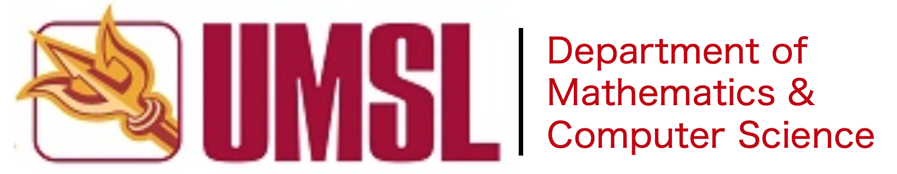
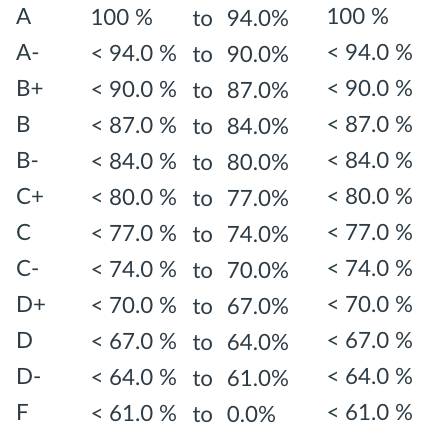

## Artificial Intelligence - CMP SCI 4300/5300
## Syllabus - 2019 Spring

[Academic Calendar](https://www.umsl.edu/services/fa/telephone-directory/academic_calendar.pdf) | [Resources & Support](https://umsl.instructure.com/courses/44471/pages/student-resources-and-supports?module_item_id=454221) |  [Technology Assistance](https://umsl.instructure.com/courses/44471/pages/technology-assistance?module_item_id=454223) | [Final Exam Schedule](https://www.umsl.edu/~registration/final-exams.html) | [Spring 2019 - All Courses](https://www.umsl.edu/~registration/students/sp19-pdf.pdf) 

## About the Instructor
* Name: Badri Adhikari
* Email: adhikarib@umsl.edu (Use your UMSL email account to send me emails)
* Office Hours: Tuesdays from 6:45 PM to 8:15 PM & Thursdays from 2:30 PM to 4 PM
* Office Location: 312 ESH
* Homepage: [https://badriadhikari.github.io](https://badriadhikari.github.io)

## About the Course
* This course provides an introduction to artificial intelligence (AI). The list of topics may include search, planning, knowledge-based reasoning, probabilistic inference, machine learning, natural language processing, and practical applications. \[3 credit units\].

* The contents of this course have been re-designed so that there is less overlap with other courses offered in our department. For this reason topics such as "Local Search Algorithms & Optimization Problems" (Chapter 4), "Learning from Examples, Supervised Learning, Artificial Neural Networks" (Chapter 18), "Learning Probabilistic Models, EM Algorithm" (Chapter 20), and "Reinforcement Learning" (Chapter 21), will not be covered in detail in this course. These topics, however, will be covered in the following courses - Deep Learning (CMP SCI 4390/5390), Machine Learning (CMP SCI 4340/5240), Data Mining (CMP SCI 4342), and Evolutionary Computation (CMP SCI 4320).

**Prerequisites**  
*CMP SCI 3130 (Design and Analysis of Algorithms) or Graduate Standing in CS

**Upon completing the course students will be able to (Learning Outcomes):** 
* Learn an overview of artificial intelligence principles and approaches
* Learn a basic understanding of the building blocks of AI as presented in terms of intelligent agents
* Select and evaluate various searching algorithms
* Understand some of the problems and ideas in the field of natural language processing, perception, and robotics
* Learn the philosophical foundations of AI and the future of AI
* Implement various AI algorithms, i.e. write programs

**Class meets**
* TR 5:30 PM - 6:45 PM at SSB 218

**Course Materials**
* Slides, Project Requirements, Tests, and Samples are inside the relevant folders at the Github location - https://github.com/badriadhikari/2019-Spring-AI/

**Textbooks**
* Artificial Intelligence: A Modern Approach (3rd Edition)     

## Course Schedule
This schedule will be updated as the class progresses.  

| `Week` | `Day` | `Date` | `Topic` | 
| --- | --- | --- | --- | 
| 01 | 01 | Jan 22, Tue | Syllabus; Chapter 1 - Slides 1 to 28 |
| 01 | 02 | Jan 24, Thu | Chapter 1 - Slides 29 to END; Chapter 2 - Slides 1 to 10 |
| 02 | 03 | Jan 29, Tue | Chapter 2 - Slides 11 to END; Chapter 18 - Slides 1 to 24 |
| 02 | 04 | Jan 31, Thu | Chapter 18 - Slides 25 to 34 |
| 03 | 05 | Feb 05, Tue | Syllabus; Chapter 18 - Slide 24 (activity); Chapter 18 - Slides 35 to 47 |
| 03 | 06 | Feb 07, Thu | |
| 04 | 07 | Feb 12, Tue | |
| 04 | 08 | Feb 14, Thu | |
| 05 | 09 | Feb 19, Tue | |
| 05 | 10 | Feb 21, Thu | Test 1 (Covering Chapter 1, 2, 18 & 3)|
| 06 | 11 | Feb 26, Tue | |
| 06 | 12 | Feb 28, Thu | |
| 07 | 13 | Mar 05, Tue | |
| 07 | 14 | Mar 07, Thu | |
| 08 | 15 | Mar 12, Tue | |
| 08 | 16 | Mar 14, Thu | |
| 09 | 17 | Mar 19, Tue | |
| 09 | 18 | Mar 21, Thu | |
| - | - | - | Spring Recess |
| 10 | 19 | Apr 02, Tue |  |
| 10 | 20 | Apr 04, Thu | Test 2 |
| 11 | 21 | Apr 09, Tue |  |
| 11 | 22 | Apr 11, Thu |  |
| 12 | 23 | Apr 16, Tue |  |
| 12 | 24 | Apr 18, Thu |  |
| 13 | 25 | Apr 23, Tue |  |
| 13 | 26 | Apr 25, Thu |  |
| 14 | 27 | Apr 30, Tue |  |
| 14 | 28 | May 02, Thu | Project Code and Report Due |
| 15 | 29 | May 07, Tue |  |
| 15 | 30 | May 09, Thu | Test3 |
| - | - | - | (Final Exam) - Poster Presentations on Tuesday, 14 May, 05:30 – 07:30 PM |  

## Course Topics
**Chapter 1 - Introduction**  
**Chapter 2 - Intelligent Agents**  
**Chapter 18 - Learning From Examples**  
**Chapter 3 - Solving Problems by Searching**  
**Chapter 5 - Adversarial Search**  
**Chapter 6 - Constraint Satisfaction Problems**  
**Chapter 7 - Logical Agents**  
**Chapter 6 - Constraint Satisfaction Problems**  
**Chapter 14 - Probabilistic Reasoning**  
**Chapter 22 - Natural Language Processing**  
**Chapter 24 - Perception**  
**Chapter 25 - Robotics**  
**Chapter 26 - Philosophical Foundations**  

## Course Policies
**General**
* Keep yourself out of plagarism - Read [UMSL's Policy](https://www.umsl.edu/services/academic/policy/academic-dishonesty.html)
* Lecture recordings, audio or video, are not permitted
* You are welcome to bring your laptop in class

**Projects**
* Graduate students will work on their projects alone
* Undergraduate students can choose to work on a project alone or as a part of a two people team
* Although project may be completed by two people, grading will be done individually
* Project grades will be average of (a) grades by instructor (b) peer grades, and (c) external examiner
* Projects will conclude with (a) a small report (b) code submission, and (c) poster presentation

**Homeworks**
* Homeworks need to be submitted through Canvas
* You are encouraged to write your programs in Python; For every homework that you submit in a non-Python language you will get 0.5 points less than what you would receive if you submitted using Python
* You are strongly encouraged to use online compilers such as [repl.it](https://repl.it); Or at least test your code using an online compiler
* You are responsible for submitting a program that "RUNS"; You will automatically receive a 0 or very low points for a submission that does not run.

**Late Homework/Project Submission** 
* You have a total of 5 late days
* Once you use your late days, late submissions will get no points

**Tests** 
* There will be three tests including one final (see the schedule for dates)
* Test will be CLOSED book, CLOSED notes, and CLOSED electronics
* Use of any type of electronics is strictly forbidden during tests

**Attendance**  
* Attendance will be recorded in every class
* You will automatically fail the course if you miss more than 5 classes

## Assessment/Grading
**Grade Composition**
* 20 points = Homeworks
* 60 points = Tests
* 20 points = Project Presentation & Final Report  
* 1 bonus point to everyone in the class if 80%+ complete the course evaluation survey

**Grading Scheme (from Canvas)**  
   
