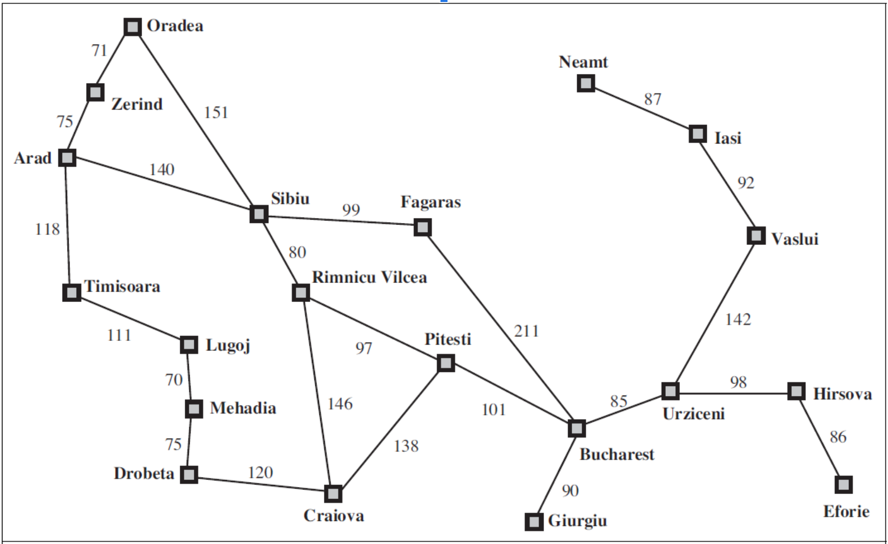

**Programming Homework 1 (Chapter 3)**  
With your choice of programming language, implement the Breadth First Search algorithm, to find solution for the Romania route finding problem, i.e. find the shortest path to reach Bucharest from Arad.  
  

**Homework 2 (Chapter 4)**  
For the following game tree, show which nodes/sub-tree will be pruned by the Alpha-Beta pruning algorithm. Assume that the nodes are processed from left to right.  

**Programming Homework 3**  
BM25 scoring

**Programming Homework 4**  
PageRank calculation

**Programming Homework 5**  
Implement convolution
